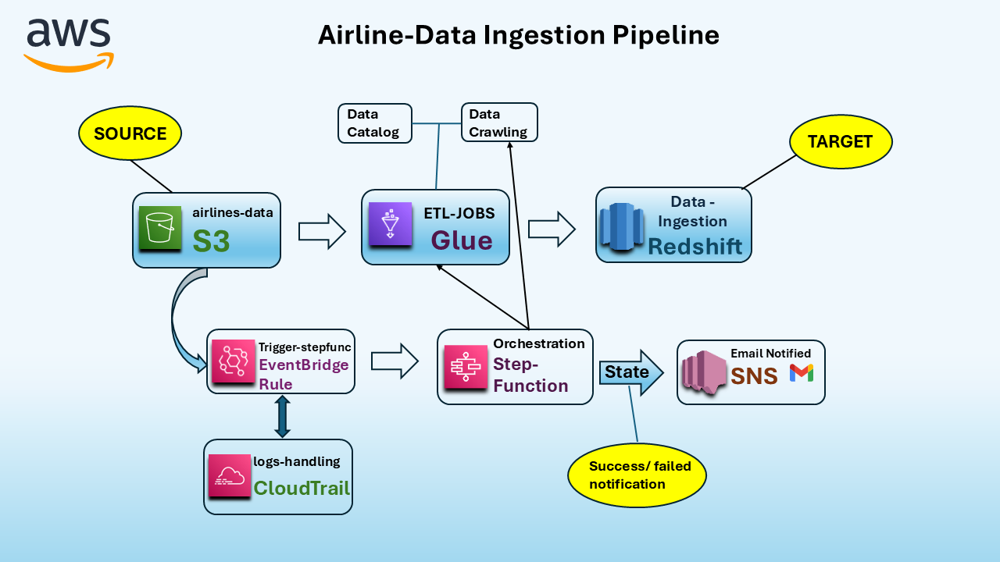
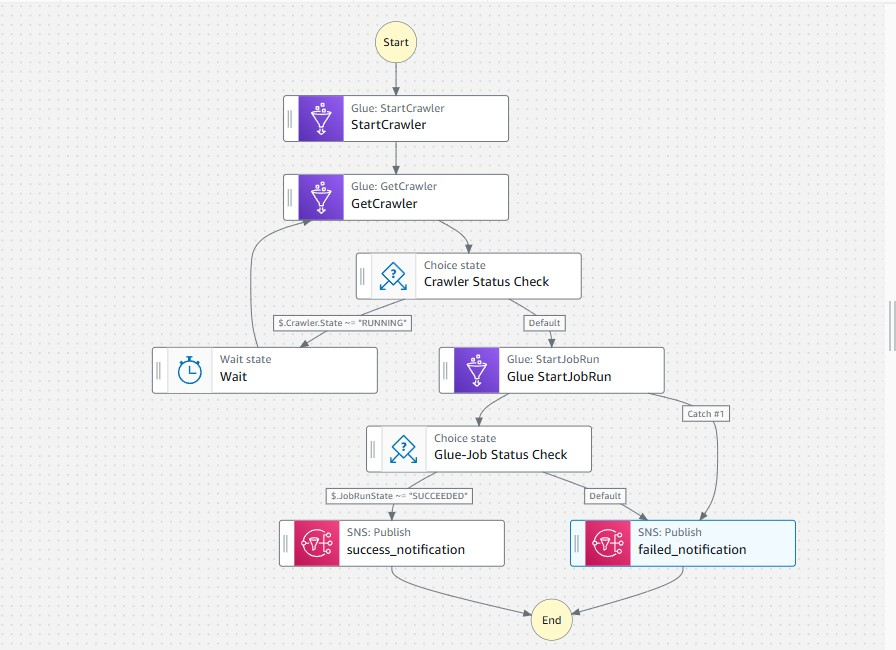
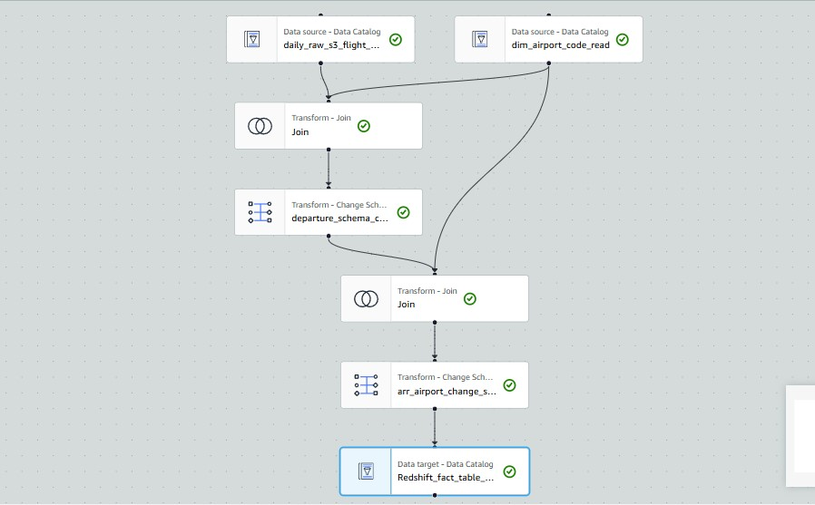
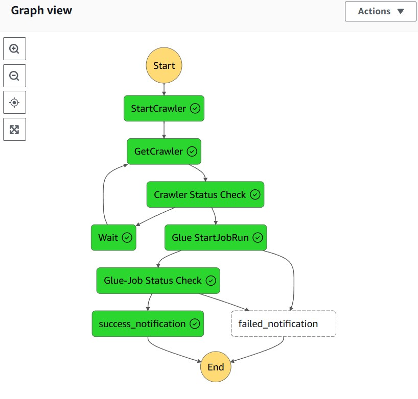
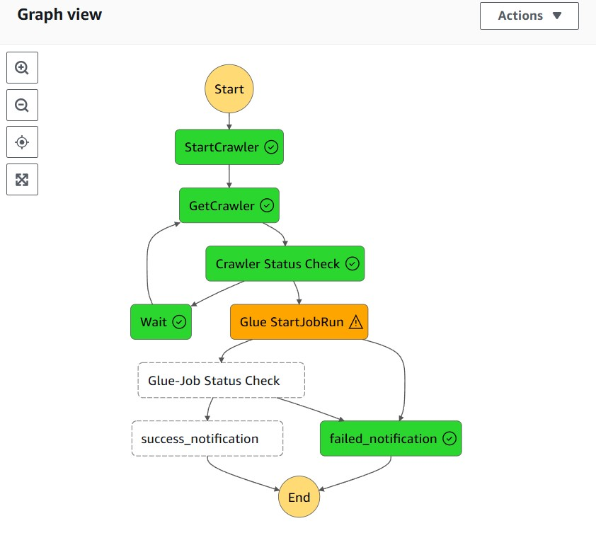

# Automated-Airline-Data-Ingestion
This project automates the ingestion, processing, and storage of airline data in Amazon Redshift. The workflow is triggered by an S3 event when new files are uploaded to a specific S3 location. AWS Step Functions orchestrate the process, with each step handling different stages of data ingestion and error handling.

### Workflow Summary

1. **Data Upload**: New airlines_booking_data files are uploaded to a specific S3 bucket.
2. **Event Trigger**: EventBridge detects file uploads and triggers an AWS Step Function.
3. **Data Crawling**: AWS Glue catalogs the data in the Glue Data Catalog.
4. **ETL Job**: AWS Glue Jobs performs ETL and loads data into Redshift.
5. **Notifications**: Success and failure notifications are sent via SNS to email.

### Table of Contents

- [Architecture Diagram](#architecture-diagram)
- [Prerequisites](#prerequisites)
- [Tech Stack](#tech-stack)
- [Implementation Process](#implementation-process)
- [Error Handling](#error-handling)
- [Usage](#usage)

---

## Architecture Diagram

*This diagram illustrates the automated workflow for the airline data ingestion pipeline.*

The architecture consists of:
- **Amazon S3**: A designated S3 bucket stores raw airline data files.
- **EventBridge**: Listens for `PUT` events in the S3 bucket to trigger the pipeline.
- **Step Functions**: Orchestrates the data ingestion process.
- **AWS Glue**: Crawlers scan data, and ETL jobs transform and prepare it for analysis.
- **Amazon Redshift**: Stores processed data for querying and analysis.
- **SNS**: Provides notifications for successful and failed runs.

---

## Prerequisites

- **AWS Account**: Free Tier or higher, with permissions to use S3, EventBridge, Step Functions, Glue, Redshift, and SNS.
- **AWS CLI**: Configured with appropriate IAM permissions.
- **Redshift Cluster**: With JDBC connection details.
- **SNS Topic**: For email notifications.

---

## Tech Stack

This project uses the following AWS services and technologies:

- **Amazon S3**: Stores the raw airline data files uploaded to a specific bucket.
- **AWS EventBridge**: Monitors the S3 bucket for `PUT` events and triggers the Step Function when a new file is uploaded.
- **AWS Step Functions**: Manages the workflow by orchestrating data crawling, ETL processing, and error handling.
- **AWS Glue**: Utilizes Crawlers to update the data catalog and ETL jobs to transform and prepare the data.
- **Amazon Redshift**: Stores the transformed data in a Redshift table for easy querying and analysis.
- **Amazon SNS (Simple Notification Service)**: Sends email notifications for pipeline status updates (success or failure).
- **AWS CloudTrail**: Logs all API calls and actions in the pipeline, providing an audit trail for monitoring and security.

---
## Implementation Process

This section outlines the pipeline's workflow and provides an overview of each step involved in processing the data. Links to the Step Function and ETL job diagrams, as well as their Python code, are included for clarity.

#### **S3 Bucket Setup**: 
   - Upload raw airline data files to the designated S3 bucket.
   - Ensure the bucket is set to trigger events on file uploads.

#### **EventBridge Rule Configuration**: 
   - Configure an EventBridge rule to listen for `PUT` events in the S3 bucket.
   - This rule triggers a Step Function workflow whenever a new file is uploaded.

#### Step Function Orchestration:
   - The Step Function manages the workflow by initiating data crawling and ETL processing sequentially.
   - It uses a **Choice State** to handle exceptions, sending a notification through SNS if any error occurs.

   **Step Function Workflow Diagram**  
     
   *This diagram illustrates the Step Function’s sequence, decision points, and notifications.*

   - **Step Function Code**: [step_function_workflow.py](stepfunction.py)

1. **Glue Crawler**:
   - The Step Function initiates an AWS Glue Crawler to scan the newly uploaded data in S3.
   - The crawler updates the Glue Data Catalog with the latest schema and metadata.

2. **ETL Job**:
   - After successful crawling, a Glue ETL job is triggered to process the data.
   - This job transforms and enriches the data before loading it into the Redshift database via a JDBC connection.

   **ETL Job Workflow Diagram**  
     
   *This diagram shows the data transformation and ingestion steps within the ETL job.*

   - **ETL Job Code**: [etl_job_script.py](glue_job.py)

3. **Redshift Data Storage**:
   - The processed data is ingested into a Redshift table, making it available for querying and analysis.
   - **Redshift Table Creation Syntax**: [create_redshift_table.txt](redshift_create_table_commands.txt)  
     *This text file contains the syntax for creating the required Redshift table.*

4. **Notifications**:
   - Throughout the pipeline, SNS notifications inform users of the workflow status:
     - **Failure Notification**: If the crawler or ETL job fails, an SNS notification is sent with details about the failure.
     - **Success Notification**: If all steps complete successfully, an SNS notification confirms the successful run.

---

## Error Handling

The pipeline includes robust error-handling mechanisms at every stage to ensure reliability and transparency in case of failures. Below are the details of error handling within each stage:

### Step 1: Glue Crawler

- **Failure Scenario**: If the Glue Crawler encounters an issue, such as failing to read or process the data due to schema inconsistencies, missing files, or access permissions, the Step Function will route the workflow to the error-handling path.
- **Error Action**: A **Choice State** in Step Functions checks for any failure in the Glue Crawler step. If an error is detected:
   - The workflow sends a **failure notification** via Amazon SNS to inform users about the issue.
   - **SNS Notification**: The failure details are sent to a configured email address, alerting users to the issue.

### Step 2: ETL Job

- **Failure Scenario**: If the ETL job fails, for example, due to issues in data transformation, missing dependencies, or errors in the script, the workflow will trigger the failure path.
- **Error Action**: 
   - Similar to the Glue Crawler step, the Step Function uses a **Choice State** to detect any failure in the ETL job.
   - Upon failure, SNS sends a **failure notification** with details about the error.
   - **SNS Notification**: The failure notification is sent to the configured email address, outlining the error that occurred in the ETL job.

### General Workflow Failure

- **Scenario**: If any part of the workflow fails, such as a misconfigured EventBridge rule or an API call failure in AWS Glue, the system will handle it by following the error path in Step Functions.
- **Error Action**: 
   - A **generic failure notification** is sent via SNS, informing users of the failure.
   - **CloudTrail Logs**: All errors and actions are logged for audit purposes. You can refer to CloudTrail logs to investigate specific failures and API calls that might have caused the issue.

### CloudTrail Integration

- **Audit Trail**: AWS CloudTrail is used throughout the pipeline to log all API activity. CloudTrail tracks and logs every request made to AWS services, allowing you to monitor the state of each service and troubleshoot issues effectively.
- **Error Action**: In case of any service failure or unexpected behavior, you can review the CloudTrail logs to get additional details about the source of the problem.

### Step Function Execution Diagram

The following diagrams show the Step Function execution flow for both **successful** and **failed** workflows:

#### Successful Execution Flow

  
*This diagram illustrates the workflow when the entire pipeline completes successfully, with all steps (Glue Crawler, ETL job, and Redshift ingestion) executing as expected. After successful completion, a **success notification** is sent to inform users of the successful run.*

#### Failed Execution Flow

  
*This diagram illustrates the workflow when one or more steps fail (such as the Glue Crawler or ETL job). If an error occurs, the workflow triggers a failure path, sending a **failure notification** with details of the issue.*

---
## Usage

To execute the **Automated Airline Data Ingestion** pipeline, simply upload a file to the designated S3 directory. Once the file is uploaded, the pipeline is automatically triggered, and the entire execution process is carried out seamlessly. The processed data is then ingested into the target Redshift table.

Throughout the process, notifications will be sent via SNS:
- A **success notification** is sent to your email once the data is successfully processed and ingested into Redshift.
- In case of any errors during the process (e.g., while crawling or during the ETL job), a **failure notification** is sent to inform you of the issue.

